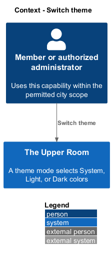
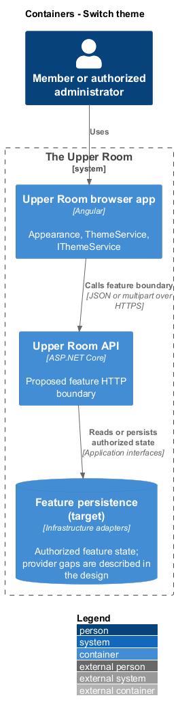
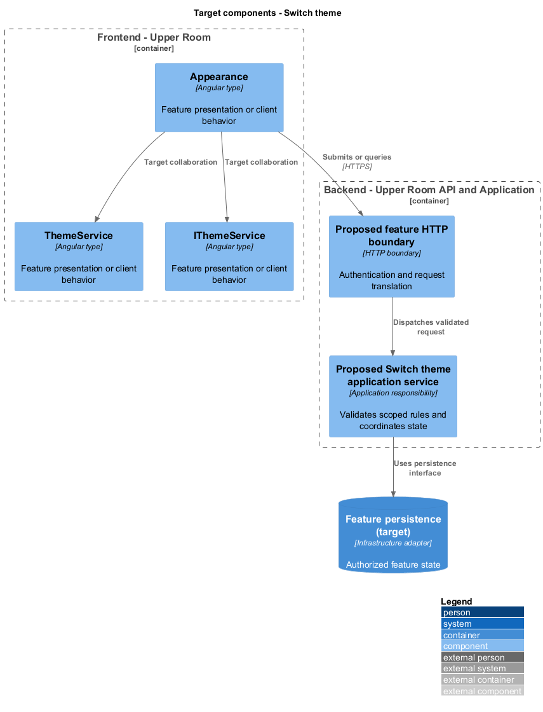
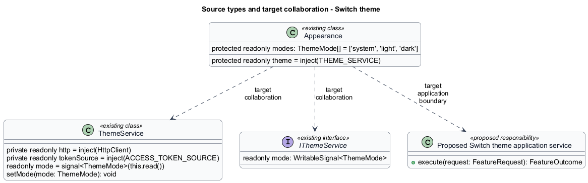
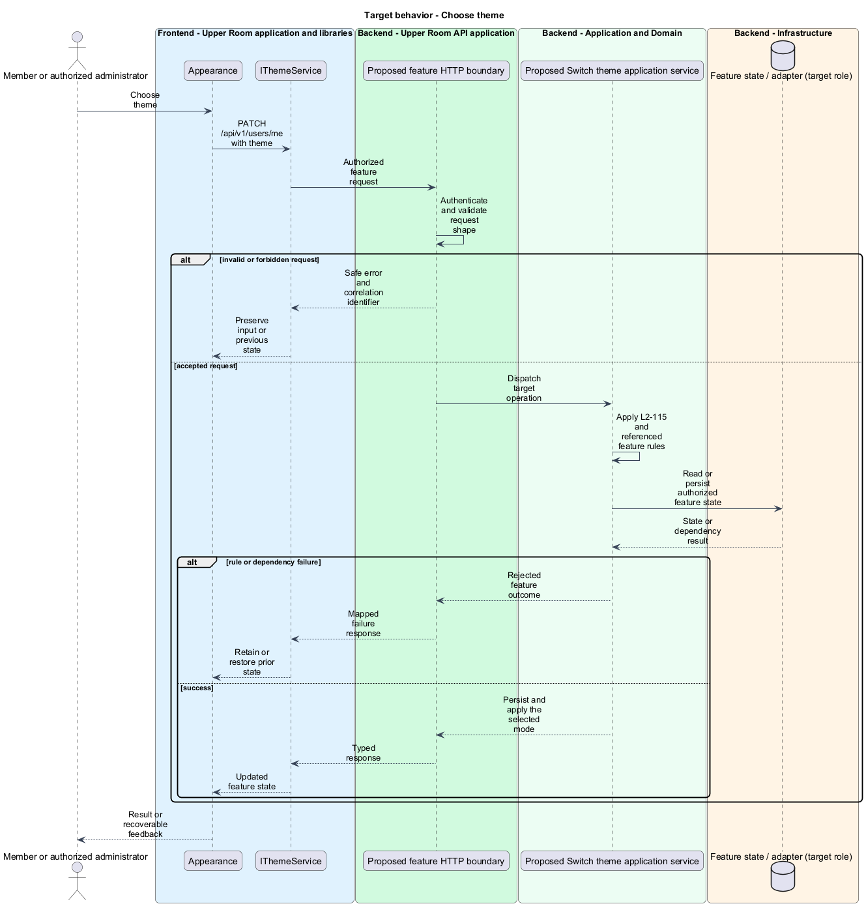
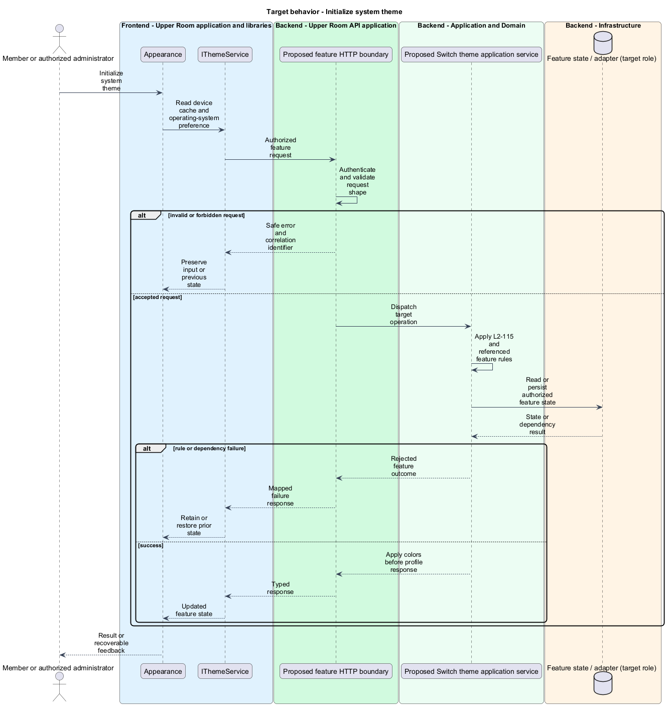

# Switch theme

## Overview

The Upper Room manages contacts, partners, ideas, events, locations, and boards in city-scoped workspaces.

A theme mode selects System, Light, or Dark colors. The device preference supplies an initial appearance while the authenticated profile carries the user preference.

## Description

### Existing implementation

The following source elements provide the current implementation points. Their presence does not establish complete requirement coverage.

| Source | Concrete elements | Observed surface |
|---|---|---|
| [frontend/projects/the-upper-room/src/app/settings/appearance/appearance.ts](../../../../frontend/projects/the-upper-room/src/app/settings/appearance/appearance.ts) | `Appearance` | protected readonly theme = inject(THEME_SERVICE); protected readonly modes: ThemeMode[] = ['system', 'light', 'dark'] |
| [frontend/projects/domain/src/lib/theme/theme.service.ts](../../../../frontend/projects/domain/src/lib/theme/theme.service.ts) | `ThemeService` | private readonly http = inject(HttpClient); private readonly tokenSource = inject(ACCESS_TOKEN_SOURCE); readonly mode = signal<ThemeMode>(this.read()) |
| [frontend/projects/domain/src/lib/theme/theme.service.contract.ts](../../../../frontend/projects/domain/src/lib/theme/theme.service.contract.ts) | `IThemeService` | readonly mode: WritableSignal<ThemeMode> |

### Target behavior and interfaces

ThemeService shall apply the cached mode before profile loading completes. System mode shall respond to operating-system theme changes. Profile persistence shall use an injected API contract rather than direct HttpClient calls in the domain service.

- **Choose theme:** PATCH /api/v1/users/me with theme. Persist and apply the selected mode.
- **Initialize system theme:** Read device cache and operating-system preference. Apply colors before profile response.

Diagrams show target collaborations. Existing source types retain their names. Participants marked as target roles or proposed responsibilities describe interfaces to introduce, not existing classes.

### Gaps and compatibility

ThemeService writes localStorage and PATCHes /api/v1/users/me directly. Its error callback currently discards persistence errors. The target shall retain the device choice and expose failed profile persistence without storing authentication tokens.

Production implementation shall follow [AGENTS.md](../../../../AGENTS.md), including incremental acceptance testing. API integrations shall preserve documented behavior until an explicit compatibility change is approved.

## Requirements

The table preserves the opening requirement statement and all parent identifiers. The expandable source excerpts retain the complete normative text and acceptance criteria verbatim. Source wording is quoted rather than normalized to the design prose.

| L2 ID | Refines (L1) | Requirement |
|---|---|---|
| [L2-115](../../../specs/L2.md#l2-115-theming-toggle) | `L1-015` | A theme toggle (System / Light / Dark) lives in the user menu and `/settings/appearance`. The choice is persisted per user (server-side) and per device (local storage fallback). Default is System. |

L2-115: Theming Toggle — specification excerpt

A theme toggle (System / Light / Dark) lives in the user menu and `/settings/appearance`. The choice is persisted per user (server-side) and per device (local storage fallback). Default is System.

**Acceptance Criteria:**
1. Given the user selects "Dark", when persisted, then the next page load applies the dark theme even before the API returns the preference (cached locally).

## Diagrams

### System context

The context identifies the people and application boundary used by this capability.

### Container view

The container view separates browser execution from any backend state responsibility. Provider choices remain subject to the stated gaps.

### Target component view

The component view shows target collaborations between the concrete implementation points and proposed application responsibilities.

### Type structure

The structure view lists source types with declared members where available. Dashed dependencies denote proposed collaboration rather than verified current dependency direction.

### Choose theme

The target flow performs the following operation: PATCH /api/v1/users/me with theme. Its successful outcome is: Persist and apply the selected mode. Alternate branches retain prior state or return recoverable failure.

### Initialize system theme

The target flow performs the following operation: Read device cache and operating-system preference. Its successful outcome is: Apply colors before profile response. Alternate branches retain prior state or return recoverable failure.

