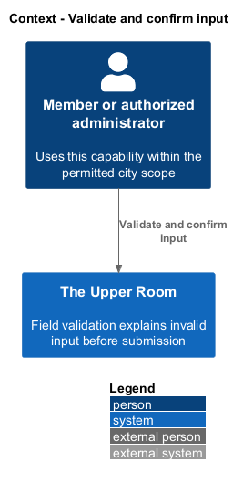
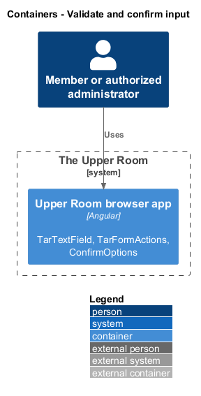
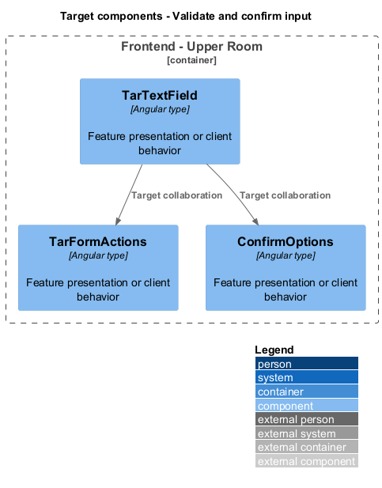
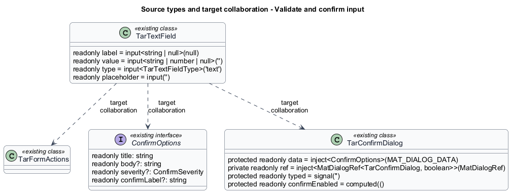
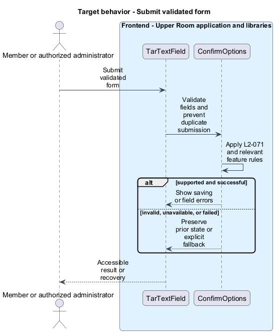
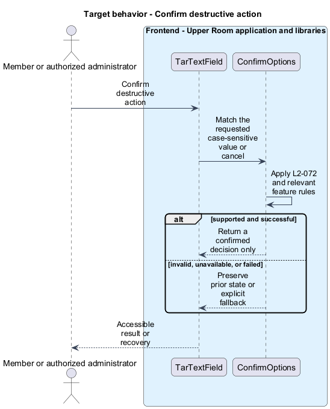

# Validate and confirm input

## Overview

The Upper Room manages contacts, partners, ideas, events, locations, and boards in city-scoped workspaces.

Field validation explains invalid input before submission. Confirmation asks for a deliberate decision before a destructive action, including an exact typed value when requested.

## Description

### Existing implementation

The following source elements provide the current implementation points. Their presence does not establish complete requirement coverage.

| Source | Concrete elements | Observed surface |
|---|---|---|
| [frontend/projects/components/src/lib/text-field/text-field.ts](../../../../frontend/projects/components/src/lib/text-field/text-field.ts) | `TarTextField` | readonly label = input<string \| null>(null); readonly value = input<string \| number \| null>(''); readonly type = input<TarTextFieldType>('text') |
| [frontend/projects/components/src/lib/form-actions/form-actions.ts](../../../../frontend/projects/components/src/lib/form-actions/form-actions.ts) | `TarFormActions` | Declarations and configuration in the linked source |
| [frontend/projects/components/src/lib/confirm-dialog/confirm.service.ts](../../../../frontend/projects/components/src/lib/confirm-dialog/confirm.service.ts) | `ConfirmOptions`, `ConfirmService` | readonly title: string; readonly body?: string; readonly severity?: ConfirmSeverity |
| [frontend/projects/components/src/lib/confirm-dialog/tar-confirm-dialog.ts](../../../../frontend/projects/components/src/lib/confirm-dialog/tar-confirm-dialog.ts) | `TarConfirmDialog` | protected readonly data = inject<ConfirmOptions>(MAT_DIALOG_DATA); private readonly ref = inject<MatDialogRef<TarConfirmDialog, boolean>>(MatDialogRef); protected readonly typed = signal('') |

### Target behavior and interfaces

TarTextField and form consumers shall connect labels, required markers, helper text, and field errors. TarFormActions shall represent submitting, success, and failure states without duplicate requests. ConfirmService shall open TarConfirmDialog through CDK Dialog. A cancelled or unmatched confirmation shall perform no mutation.

- **Submit validated form:** Validate fields and prevent duplicate submission. Show saving or field errors.
- **Confirm destructive action:** Match the requested case-sensitive value or cancel. Return a confirmed decision only.

Diagrams show target collaborations. Existing source types retain their names. Participants marked as target roles or proposed responsibilities describe interfaces to introduce, not existing classes.

### Gaps and compatibility

The spec names mat-dialog; AGENTS.md prescribes CDK Dialog. The target follows CDK Dialog and retains the specified confirmation semantics. Field validation does not replace server validation.

Production implementation shall follow [AGENTS.md](../../../../AGENTS.md), including incremental acceptance testing. API integrations shall preserve documented behavior until an explicit compatibility change is approved.

## Requirements

The table preserves the opening requirement statement and all parent identifiers. The expandable source excerpts retain the complete normative text and acceptance criteria verbatim. Source wording is quoted rather than normalized to the design prose.

| L2 ID | Refines (L1) | Requirement |
|---|---|---|
| [L2-071](../../../specs/L2.md#l2-071-field-specifications) | `L1-028` | All form fields must be `mat-form-field` with `appearance="outline"`. Field anatomy: label (top, floats), input, helper text (left), error text (replaces helper when invalid). Field height `56px` (default), `48px` for "dense" forms in dialogs. Padding inside input `0 $space-4`. Error icon `error` appears at trailing edge when invalid. Error messages are announced via `aria-live="polite"`. |
| [L2-072](../../../specs/L2.md#l2-072-required-field-marking) | `L1-028`, `L1-018` | Required fields show an asterisk after the label in `--md-sys-color-error`. The form must include the legend "* indicates required" once per form. Fields use `aria-required="true"`. |
| [L2-073](../../../specs/L2.md#l2-073-submit-button-states) | `L1-028` | Primary submit buttons use `mat-button` filled variant, height `40px` (XS) / `48px` (MD+). States: idle (label only), pending (label hidden, spinner shown via `mat-progress-spinner` 20px, button disabled), success (label "Saved", icon `check`, `--md-sys-color-tertiary` for `1500ms` then resets), error (label restored, snackbar). Buttons must remain disabled while pending and during the 1.5s success window. |
| [L2-099](../../../specs/L2.md#l2-099-confirmation-dialog-specification) | `L1-016`, `L1-017` | A reusable `<tar-confirm-dialog>` is invoked via a service method `confirm({ title, body, confirmLabel, cancelLabel, severity, requireTypedConfirmation, typedConfirmationLabel })`. Layout: `mat-dialog` of width `min(480px, 100vw - $space-8)`, padding `$space-6`, title `headline-small`, body `body-medium`, footer right-aligned with cancel (text) and confirm (filled or red). Severity: - `info`: confirm button is filled primary. - `warning`: confirm button is filled `--md-sys-color-tertiary`, leading icon `warning`. - `danger`: confirm button has background `--md-sys-color-error` text `--md-sys-color-on-error`, leading icon `delete_forever`; if `requireTypedConfirmation` is true, an input appears with placeholder "Type {value} to confirm" and the button is disabled until matched (case-sensitive). |

L2-071: Field Specifications — specification excerpt

All form fields must be `mat-form-field` with `appearance="outline"`. Field anatomy: label (top, floats), input, helper text (left), error text (replaces helper when invalid). Field height `56px` (default), `48px` for "dense" forms in dialogs. Padding inside input `0 $space-4`. Error icon `error` appears at trailing edge when invalid. Error messages are announced via `aria-live="polite"`.

**Acceptance Criteria:**
1. Given a field becomes invalid, when announced, then a screen reader hears the error text within `1000ms`.

L2-072: Required Field Marking — specification excerpt

Required fields show an asterisk after the label in `--md-sys-color-error`. The form must include the legend "* indicates required" once per form. Fields use `aria-required="true"`.

**Acceptance Criteria:**
1. Given a required field, when rendered, then the label visually contains "*" and the input has the attribute `aria-required="true"`.

L2-073: Submit Button States — specification excerpt

Primary submit buttons use `mat-button` filled variant, height `40px` (XS) / `48px` (MD+). States: idle (label only), pending (label hidden, spinner shown via `mat-progress-spinner` 20px, button disabled), success (label "Saved", icon `check`, `--md-sys-color-tertiary` for `1500ms` then resets), error (label restored, snackbar). Buttons must remain disabled while pending and during the 1.5s success window.

**Acceptance Criteria:**
1. Given submit succeeds, when the success state is shown, then the button is disabled and not re-clickable for `1500ms`.

L2-099: Confirmation Dialog Specification — specification excerpt

A reusable `<tar-confirm-dialog>` is invoked via a service method `confirm({ title, body, confirmLabel, cancelLabel, severity, requireTypedConfirmation, typedConfirmationLabel })`. Layout: `mat-dialog` of width `min(480px, 100vw - $space-8)`, padding `$space-6`, title `headline-small`, body `body-medium`, footer right-aligned with cancel (text) and confirm (filled or red). Severity:
- `info`: confirm button is filled primary.
- `warning`: confirm button is filled `--md-sys-color-tertiary`, leading icon `warning`.
- `danger`: confirm button has background `--md-sys-color-error` text `--md-sys-color-on-error`, leading icon `delete_forever`; if `requireTypedConfirmation` is true, an input appears with placeholder "Type {value} to confirm" and the button is disabled until matched (case-sensitive).

**Acceptance Criteria:**
1. Given a danger dialog with `requireTypedConfirmation: 'DELETE'`, when the user types "delete", then the confirm button stays disabled.

## Diagrams

### System context

The context identifies the people and application boundary used by this capability.

### Container view

The container view separates browser execution from any backend state responsibility. Provider choices remain subject to the stated gaps.

### Target component view

The component view shows target collaborations between the concrete implementation points and proposed application responsibilities.

### Type structure

The structure view lists source types with declared members where available. Dashed dependencies denote proposed collaboration rather than verified current dependency direction.

### Submit validated form

The target flow performs the following operation: Validate fields and prevent duplicate submission. Its successful outcome is: Show saving or field errors. Alternate branches retain prior state or return recoverable failure.

### Confirm destructive action

The target flow performs the following operation: Match the requested case-sensitive value or cancel. Its successful outcome is: Return a confirmed decision only. Alternate branches retain prior state or return recoverable failure.

