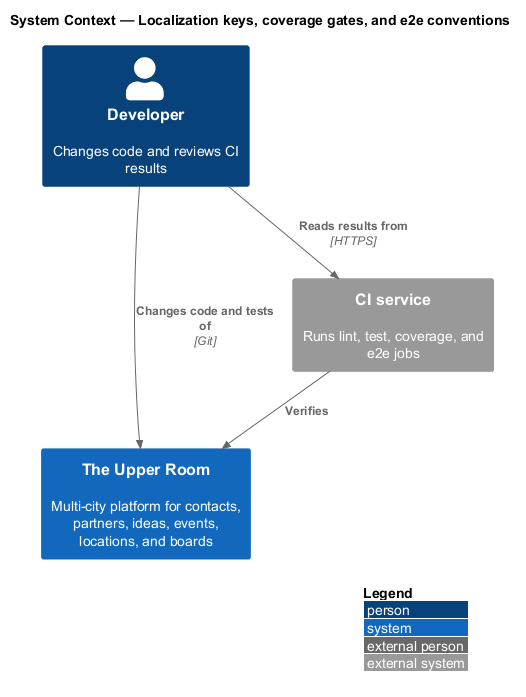
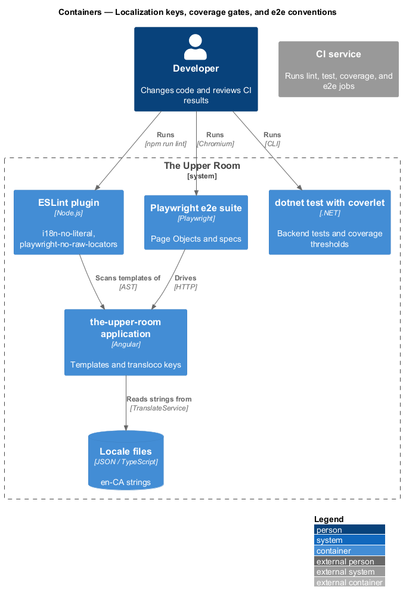
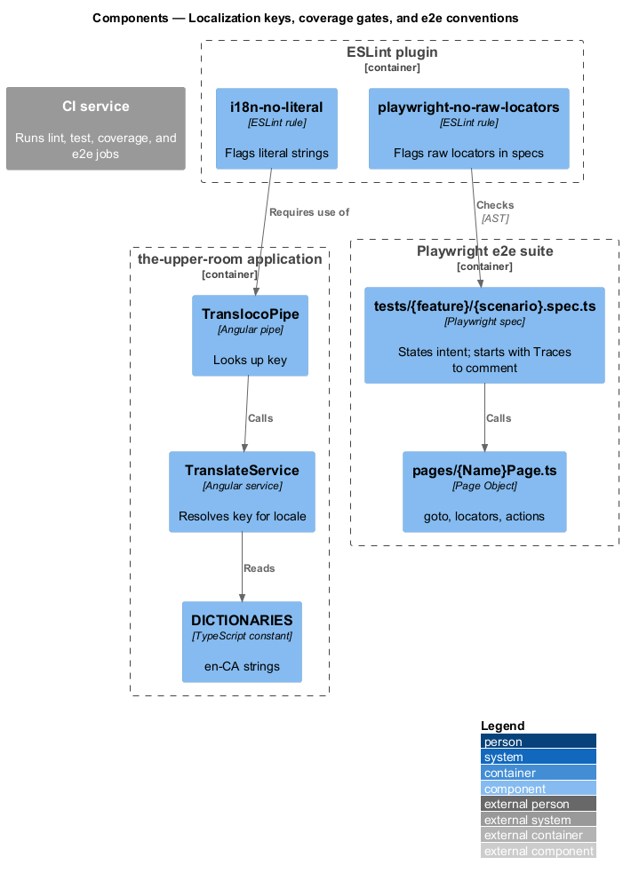
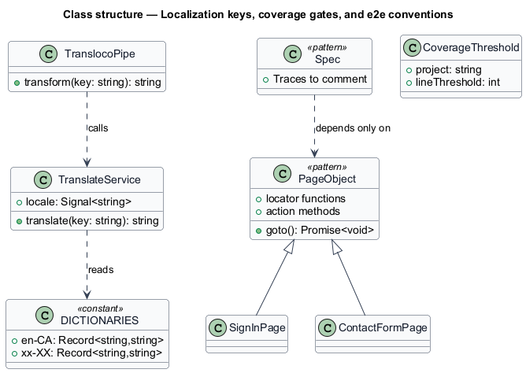
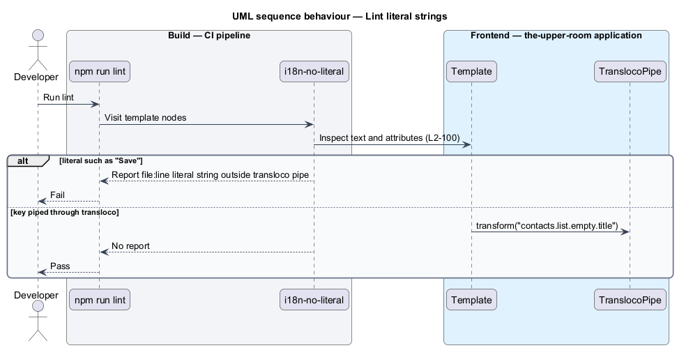
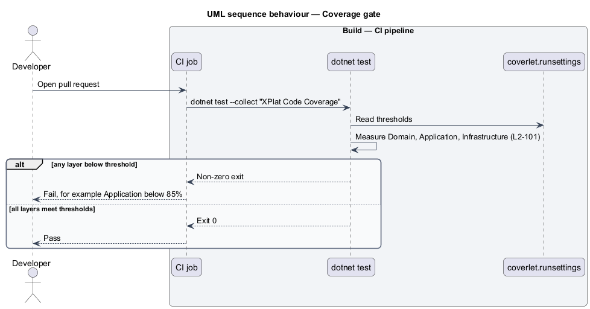
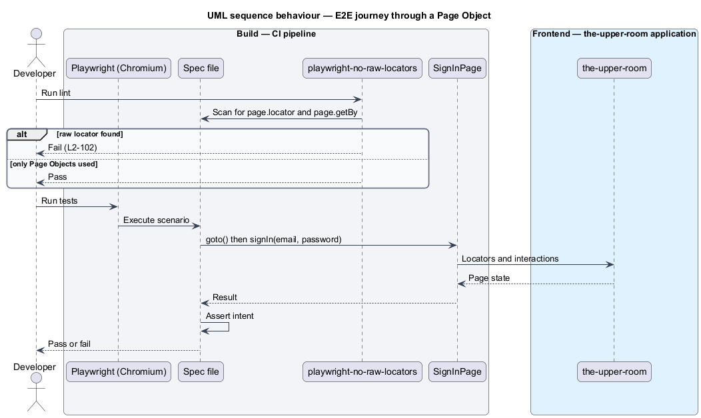

# Localization keys, coverage gates, and e2e conventions

## Overview

Quality of the product depends on externalized strings and on automated checks that prove behavior. This feature defines how user-facing text is localized, how unit-test coverage is gated, and how end-to-end tests are structured.

**translation key** — dotted identifier that selects a localized string from a locale file

**Page Object** — class that owns the locators and interactions of one screen so that tests state intent only

**coverage gate** — CI check that fails when measured coverage falls below a stated threshold

The feature groups three cross-cutting quality capabilities that are enforced by tooling rather than by a runtime user flow.

## Description

### Existing implementation

The following source elements provide the current implementation points. Their presence does not establish complete requirement coverage.

| Source | Concrete elements | Observed surface |
|---|---|---|
| [frontend/projects/components/src/lib/i18n/translate.service.ts](../../../../frontend/projects/components/src/lib/i18n/translate.service.ts) | `TranslateService` | Locale-aware lookup; `locale()` signal |
| [frontend/projects/components/src/lib/i18n/transloco.pipe.ts](../../../../frontend/projects/components/src/lib/i18n/transloco.pipe.ts) | `TranslocoPipe` (`transloco`) | Impure pipe calling `TranslateService.translate(key)` |
| [frontend/projects/the-upper-room/src/app/i18n/dictionaries.ts](../../../../frontend/projects/the-upper-room/src/app/i18n/dictionaries.ts) | `DICTIONARIES`, `DEFAULT_LOCALE` | `en-CA` holds one key (`styleguide.greeting`); `xx-XX` is a test-only locale |
| [tools/eslint-plugin-the-upper-room/lib/i18n-no-literal.js](../../../../tools/eslint-plugin-the-upper-room/lib/i18n-no-literal.js) | Rule `i18n-no-literal` | Reports literal user-facing strings; enabled from `frontend/eslint.config.js` |
| [backend/coverlet.runsettings](../../../../backend/coverlet.runsettings) | Coverlet thresholds | Line thresholds Domain 90, Application 85, Infrastructure 70 |
| [backend/tests/TheUpperRoom.Application.Tests/CoverageGatesArchitectureTests.cs](../../../../backend/tests/TheUpperRoom.Application.Tests/CoverageGatesArchitectureTests.cs) | `CoverageGatesArchitectureTests` | Existing test over the run settings |
| [tools/eslint-plugin-the-upper-room/lib/playwright-no-raw-locators.js](../../../../tools/eslint-plugin-the-upper-room/lib/playwright-no-raw-locators.js) | Rule `playwright-no-raw-locators` | Rejects `page.locator` and `page.getBy*` in `e2e/tests/**/*.spec.ts` |
| [frontend/projects/the-upper-room/e2e/pages](../../../../frontend/projects/the-upper-room/e2e/pages) | 37 Page Objects such as `SignInPage`, `ContactFormPage`, `BoardViewPage` | One class per screen |
| [frontend/playwright.config.ts](../../../../frontend/playwright.config.ts) | Playwright configuration | `testDir` `./projects/the-upper-room/e2e/tests`; projects `chromium` and `webkit` |

### Target behavior and interfaces

Every user-facing string shall be referenced through a `transloco` key resolved from `src/assets/i18n/en-CA.json`. `npm run i18n:lint` shall report literal strings with file and line.

CI shall run `dotnet test --collect:"XPlat Code Coverage"` and shall fail below Domain 90%, Application 85%, and Infrastructure 70%. Frontend libraries and application services and guards shall meet 80%.

E2E specs shall begin with `// Traces to: L2-XXX`, shall depend only on Page Objects, and shall cover the journeys listed in L2-102. The suite shall run in Chromium only.

### Gaps and compatibility

- The dictionary lives in TypeScript (`dictionaries.ts`), not in `src/assets/i18n/en-CA.json`, and holds one key. Moving to the JSON file is a target change.
- No `i18n:lint` npm script exists; `i18n-no-literal` runs through `npm run lint`.
- No frontend coverage threshold and no CI workflow enforcing backend coverage were located (`<TO SUPPLY>`).
- `playwright.config.ts` configures a `webkit` project, which conflicts with the Chromium-only rule in AGENTS.md; removal is a target change.
- The 95% pass rate and 15 minute duration of the e2e suite are not measured by any located job (`<TO SUPPLY>`).

Production implementation shall follow [AGENTS.md](../../../../AGENTS.md), including incremental acceptance testing. Existing behavior shall remain compatible until an explicit change is approved.

## Requirements

The table preserves the requirement statement and all parent identifiers. The expandable source excerpts retain the complete normative text and acceptance criteria verbatim.

| L2 ID | Refines (L1) | Requirement |
|---|---|---|
| [L2-100](../../../specs/L2.md#l2-100-i18n-keys-and-locale-files) | `L1-025` | All user-facing strings (labels, helper text, placeholders, errors, snackbars, page titles) must be referenced via `transloco` keys (e.g. `contacts.list.empty.title`). The file `src/assets/i18n/en-CA.json` is the source of truth. No literal user-facing strings may appear in component templates or TypeScript except for fallback `*ngIf` cases. |
| [L2-101](../../../specs/L2.md#l2-101-unit-test-coverage) | `L1-024` | Unit test coverage targets: Domain >= 90%, Application >= 85%, Infrastructure >= 70%, Frontend libraries >= 80%, Frontend application services and guards >= 80%. CI fails below the thresholds. |
| [L2-102](../../../specs/L2.md#l2-102-playwright-e2e-with-page-object-model) | `L1-024` | E2E tests live in `frontend/projects/the-upper-room/e2e/`. Each page has a Page Object class `pages/{Name}Page.ts` with `goto()`, locators (functions returning `Locator`), and high-level actions. Tests live in `tests/{feature}/{scenario}.spec.ts` and depend ONLY on Page Objects (no raw `page.locator(...)` in spec files). Required journeys: - Sign-in (success, failure, lockout) - Sign-up + email verification - Forgot/reset password - Create contact (full form) - Edit contact, archive, delete - Create partner and link contact - Create board, configure columns, create card, drag card across columns - Create idea, vote, change status - Create event, RSVP, view in calendar - Create location and reference from event - Global search returns results across resources - Notification preferences toggle persists - Offline banner appears and disappears Each spec file MUST start with the comment `// Traces to: L2-XXX[, L2-XXX]`. |

L2-100: i18n Keys and Locale Files — specification excerpt

All user-facing strings (labels, helper text, placeholders, errors, snackbars, page titles) must be referenced via `transloco` keys (e.g. `contacts.list.empty.title`). The file `src/assets/i18n/en-CA.json` is the source of truth. No literal user-facing strings may appear in component templates or TypeScript except for fallback `*ngIf` cases.

**Acceptance Criteria:**
1. Given a template contains the literal "Save", when `npm run i18n:lint` runs, then the script reports "literal string outside of `transloco` pipe" with file:line.

L2-101: Unit Test Coverage — specification excerpt

Unit test coverage targets: Domain >= 90%, Application >= 85%, Infrastructure >= 70%, Frontend libraries >= 80%, Frontend application services and guards >= 80%. CI fails below the thresholds.

**Acceptance Criteria:**
1. Given a PR drops Application coverage below 85%, when CI runs, then `dotnet test --collect:"XPlat Code Coverage"` and the coverage gate fail.

L2-102: Playwright E2E with Page Object Model — specification excerpt

E2E tests live in `frontend/projects/the-upper-room/e2e/`. Each page has a Page Object class `pages/{Name}Page.ts` with `goto()`, locators (functions returning `Locator`), and high-level actions. Tests live in `tests/{feature}/{scenario}.spec.ts` and depend ONLY on Page Objects (no raw `page.locator(...)` in spec files). Required journeys:

- Sign-in (success, failure, lockout)
- Sign-up + email verification
- Forgot/reset password
- Create contact (full form)
- Edit contact, archive, delete
- Create partner and link contact
- Create board, configure columns, create card, drag card across columns
- Create idea, vote, change status
- Create event, RSVP, view in calendar
- Create location and reference from event
- Global search returns results across resources
- Notification preferences toggle persists
- Offline banner appears and disappears

Each spec file MUST start with the comment `// Traces to: L2-XXX[, L2-XXX]`.

**Acceptance Criteria:**
1. Given a spec file uses `page.locator('button:has-text("Save")')`, when ESLint runs, then the rule `the-upper-room/playwright-no-raw-locators` fails.
2. Given the full e2e suite runs in CI, when complete, then >= 95% of tests pass and the run takes <= 15 minutes on the standard runner.

## Diagrams

### System context

The context identifies the people and external systems around this capability.

### Container view

The container view separates browser, API, build, and data responsibilities for this capability.

### Component view

The component view shows the concrete implementation points and the target responsibilities that collaborate in this slice.

### Type structure

The structure view lists the types in this slice with members where known. Dashed dependencies denote target collaboration rather than verified current dependency direction.

### Lint literal strings

The sequence shows the lint rule reporting a literal string in a template and passing a template that uses the translation pipe.

### Coverage gate

The sequence shows the CI test job collecting coverage and failing when a layer drops below its threshold.

### E2E journey through a Page Object

The sequence shows a spec calling a Page Object while the lint rule blocks raw locators in the spec.

