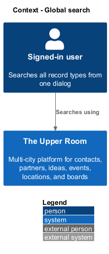
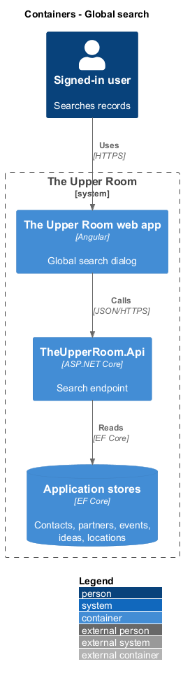
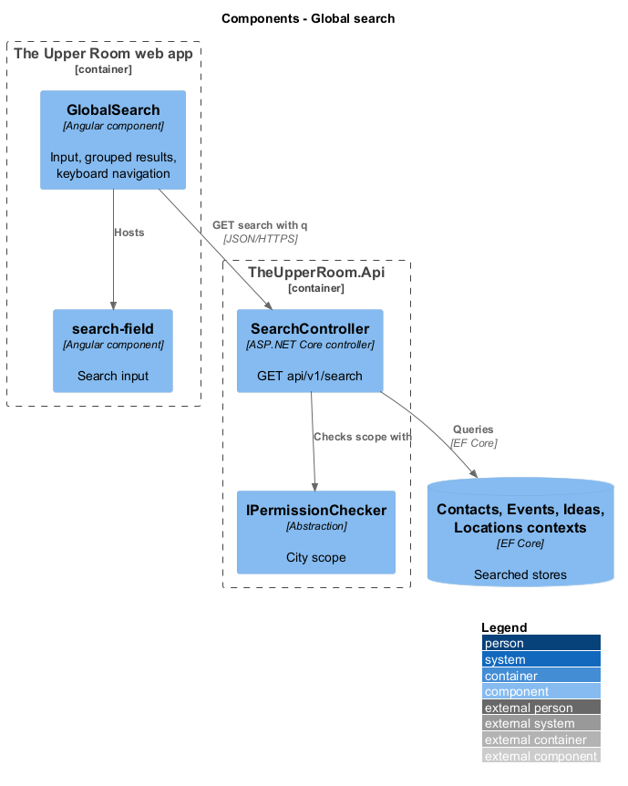
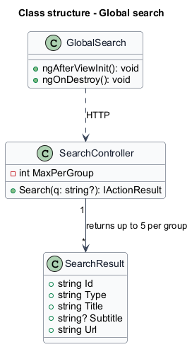
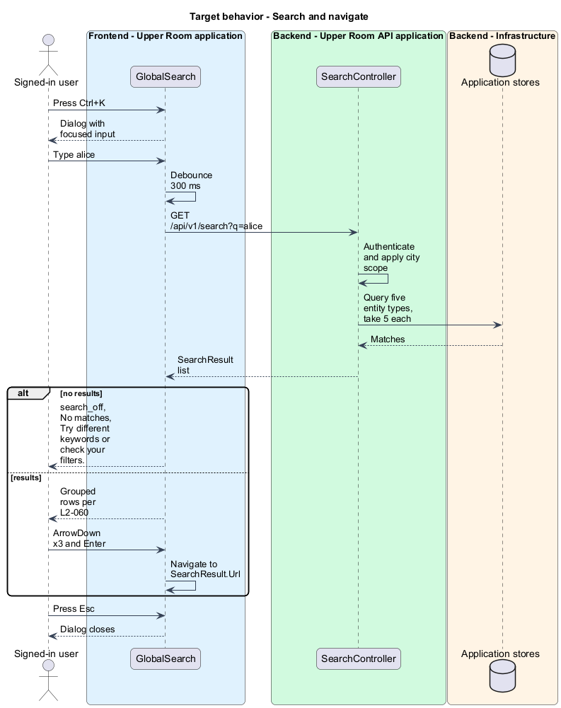

# Global search

## Overview

The Upper Room is a multi-city platform in which each city has its own workspace of contacts, partners, ideas, events, locations, and boards.

Global search lets a member find a record in any of five entity types from one dialog, without first navigating to the owning list.

**result group** — set of search results of one entity type, capped at 5 rows

The dialog opens from the search icon or the `Ctrl+K` / `Cmd+K` shortcut, shows grouped results as the user types, and navigates to the chosen record.

## Description

### Existing implementation

The following source elements provide the current implementation points. Their presence does not establish complete requirement coverage.

| Source | Concrete elements | Observed surface |
|---|---|---|
| [frontend/projects/the-upper-room/src/app/search/global-search.ts](../../../../frontend/projects/the-upper-room/src/app/search/global-search.ts) | `GlobalSearch` | `HttpClient`, `Router` injected; implements `AfterViewInit`, `OnDestroy` |
| [frontend/projects/components/src/lib/search-field/search-field.ts](../../../../frontend/projects/components/src/lib/search-field/search-field.ts) | `search-field` | Reusable search input |
| [backend/src/TheUpperRoom.Api/Search/SearchController.cs](../../../../backend/src/TheUpperRoom.Api/Search/SearchController.cs) | `SearchController` | Route `api/v1/search`; `HttpGet` with query `q`; `MaxPerGroup` of 5; reads contacts, partners, events, ideas, locations |
| [backend/src/TheUpperRoom.Api/Search/SearchResult.cs](../../../../backend/src/TheUpperRoom.Api/Search/SearchResult.cs) | `SearchResult` | `Id`, `Type`, `Title`, `Subtitle`, `Url` |

### Target behavior and interfaces

`SearchController.Search` returns an empty result for a blank `q`, applies the city scope of the caller, and returns up to 5 `SearchResult` items per group. `GlobalSearch` opens as a centered dialog (width `min(640px, 100vw - $space-8)`, top at `15vh`) with an autofocused input, leading icon `search`, placeholder "Search contacts, partners, events, ideas, locations...", and a trailing "Esc" hint. It debounces input by 300 ms, renders grouped rows with icon, primary label, and secondary label, supports ArrowUp, ArrowDown, and Enter, and shows an empty state with icon `search_off`, heading "No matches", and body "Try different keywords or check your filters.".

The dialog shall use Angular CDK Dialog or Overlay per [AGENTS.md](../../../../AGENTS.md); the source type used today is `<TO SUPPLY>`.

### Gaps and compatibility

The requirement names `mat-dialog`; the repository convention names CDK Dialog. The reconciliation is `<TO SUPPLY>`. `SearchController` takes `DbContext` types directly instead of an application-layer query; moving the logic is `<TO SUPPLY>`. Group names in the response are carried by `SearchResult.Type`.

## Requirements

| L2 ID | Refines (L1) | Requirement |
|---|---|---|
| [L2-060](../../../specs/L2.md#l2-060-global-search-dialog) | `L1-027` | Triggered by the search icon or `Ctrl+K`/`Cmd+K`. The dialog is a centered `mat-dialog` (width `min(640px, 100vw - $space-8)`, padded `0`, top-positioned at `15vh`). Header is a search input (autofocus, leading icon `search`, placeholder "Search contacts, partners, events, ideas, locations...", trailing kbd hint "Esc"). Body shows grouped results (Contacts, Partners, Events, Ideas, Locations) with up to 5 per group; each row has icon, primary label, secondary label (e.g. organization for contact), keyboard navigation with arrow keys, Enter to navigate. |

**Acceptance criteria**

1. Given the user types "alice" then waits 300ms, when results return, then the user can press ArrowDown 3 times and Enter to navigate to the 3rd result.
2. Given no results, when shown, then the empty state has icon `search_off`, heading "No matches", body "Try different keywords or check your filters."

## Diagrams

### System context

### Container view

### Component view

### Type structure

### Search and navigate

The flow debounces input, fetches grouped results, and navigates by keyboard.

