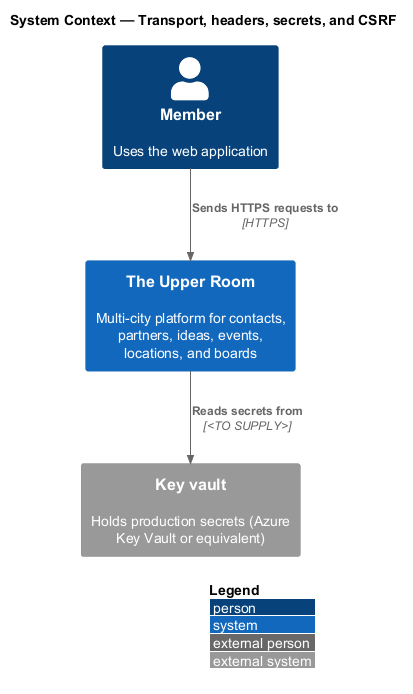
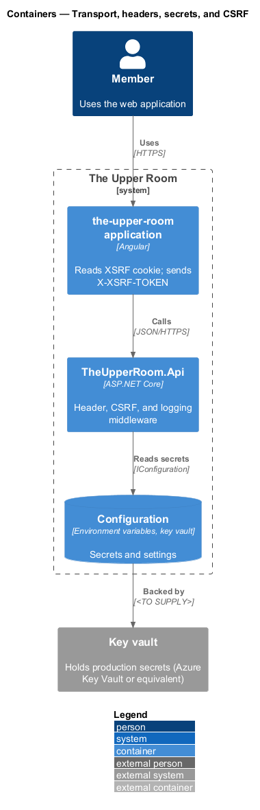
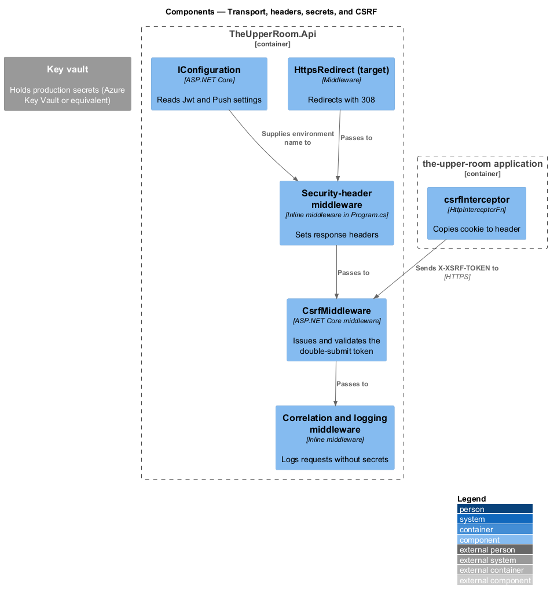
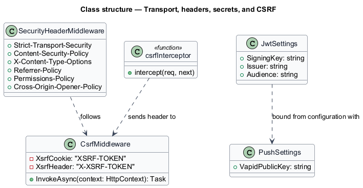
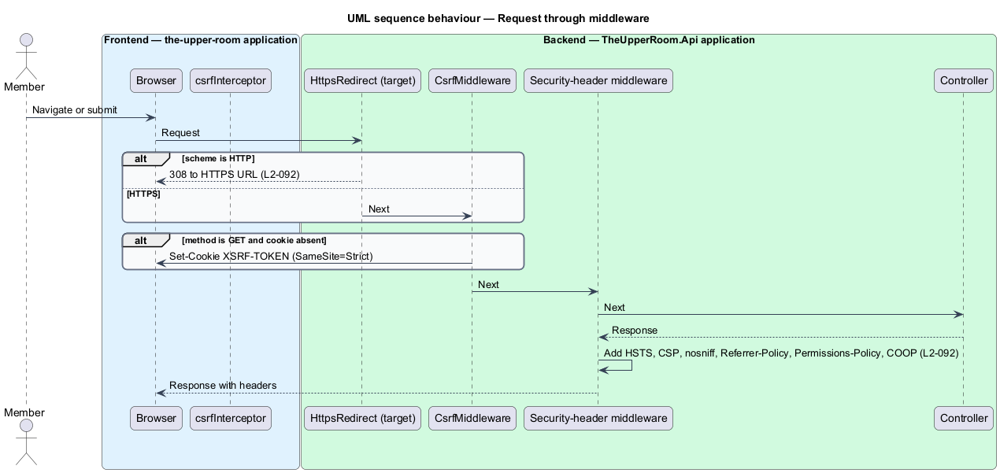
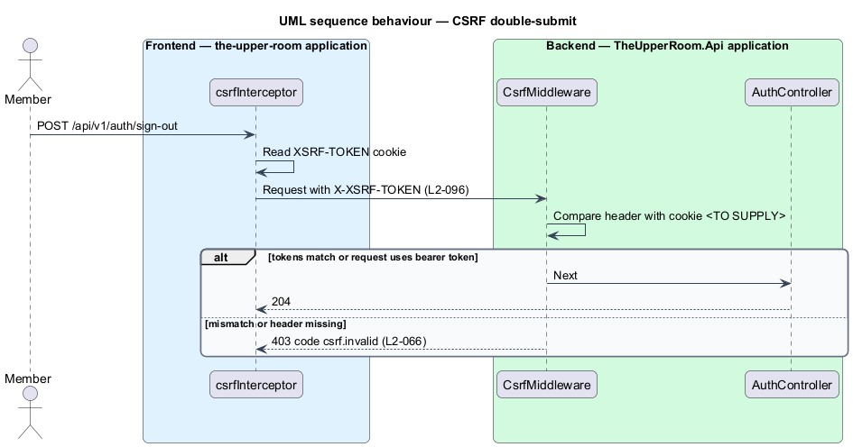
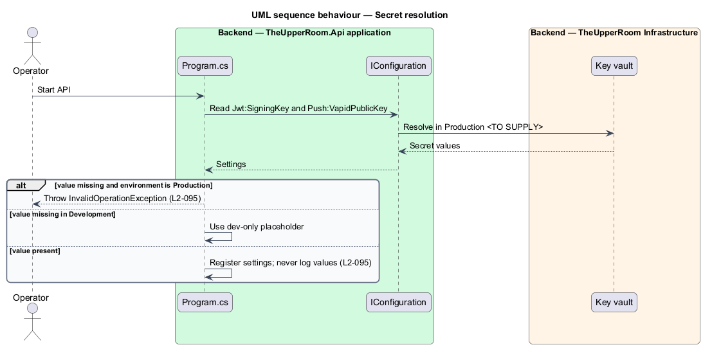

# Transport, headers, secrets, and CSRF

## Overview

Browsers and attackers act on the response headers, the transport, and the cookies an API sends. This feature defines the response-header policy, HTTPS-only transport, secret handling, and anti-forgery protection of the API and its frontend.

**HSTS** — response header that instructs browsers to use HTTPS only for a site

**CSP** — Content-Security-Policy header that restricts the origins from which a page loads resources

**double-submit token** — anti-forgery scheme in which the server issues a token cookie and the client echoes it in a request header

The feature is a cross-cutting middleware slice in the API plus an HTTP interceptor in the frontend.

## Description

### Existing implementation

The following source elements provide the current implementation points. Their presence does not establish complete requirement coverage.

| Source | Concrete elements | Observed surface |
|---|---|---|
| [backend/src/TheUpperRoom.Api/Program.cs](../../../../backend/src/TheUpperRoom.Api/Program.cs) | Inline middleware tagged `traces_to: L2-092`; `CsrfMiddleware` registration | Sets `X-Content-Type-Options`, `X-Frame-Options`, `Referrer-Policy`, `Cross-Origin-Opener-Policy`, `Permissions-Policy`, `Strict-Transport-Security`, `Content-Security-Policy`; production start-up fails when `Jwt:SigningKey` or `Push:VapidPublicKey` is missing |
| [backend/src/TheUpperRoom.Api/Auth/CsrfMiddleware.cs](../../../../backend/src/TheUpperRoom.Api/Auth/CsrfMiddleware.cs) | `CsrfMiddleware` | Issues an `XSRF-TOKEN` cookie (`SameSite=Strict`, not HttpOnly) on GET when absent |
| [frontend/projects/the-upper-room/src/app/interceptors/csrf.interceptor.ts](../../../../frontend/projects/the-upper-room/src/app/interceptors/csrf.interceptor.ts) | `csrfInterceptor` | Copies the `XSRF-TOKEN` cookie to the `X-XSRF-TOKEN` header on non-safe methods |
| [frontend/SECURITY.md](../../../../frontend/SECURITY.md) | Frontend security notes | Documentation of frontend security posture |
| [backend/tests/TheUpperRoom.Application.Tests/SecurityHeadersTests.cs](../../../../backend/tests/TheUpperRoom.Application.Tests/SecurityHeadersTests.cs) | Header tests | Existing coverage for L2-092 |
| [backend/tests/TheUpperRoom.Application.Tests/CsrfTests.cs](../../../../backend/tests/TheUpperRoom.Application.Tests/CsrfTests.cs) | CSRF tests | Existing coverage for L2-096 |

### Target behavior and interfaces

The API shall redirect non-HTTPS requests with `308 Permanent Redirect` and shall send `Strict-Transport-Security: max-age=31536000; includeSubDomains; preload`.

The API shall send the Content-Security-Policy, `X-Content-Type-Options`, `Referrer-Policy`, `Permissions-Policy`, and `Cross-Origin-Opener-Policy` values stated in L2-092 on every response.

Cookie-authenticated endpoints shall reject requests whose `X-XSRF-TOKEN` header does not match the cookie with 403 and `code: "csrf.invalid"`. Bearer-token calls are exempt.

Backend secrets shall come from environment variables in development and Azure Key Vault or an equivalent in production. `environment.ts` shall hold public configuration only, and logs shall not contain secrets.

### Gaps and compatibility

- No HTTPS redirect (`UseHttpsRedirection` or 308 response) was located in `Program.cs`.
- Existing HSTS omits `preload`. Existing CSP allows `script-src 'unsafe-inline'` and Google Fonts origins and omits `connect-src https://api.{env}`; it differs from the required value.
- `CsrfMiddleware` issues the cookie but does not validate the header or return `csrf.invalid`; the token is not marked `Secure`. Validation is a target change.
- Production key-vault integration and a `git-secrets` scan job are `<TO SUPPLY>`. Development fallbacks for the signing key exist only outside Production.

Production implementation shall follow [AGENTS.md](../../../../AGENTS.md), including incremental acceptance testing. Existing behavior shall remain compatible until an explicit change is approved.

## Requirements

The table preserves the requirement statement and all parent identifiers. The expandable source excerpts retain the complete normative text and acceptance criteria verbatim.

| L2 ID | Refines (L1) | Requirement |
|---|---|---|
| [L2-092](../../../specs/L2.md#l2-092-transport-and-headers) | `L1-020` | All traffic must be HTTPS only with HSTS `max-age=31536000; includeSubDomains; preload`. Response headers: `Content-Security-Policy: default-src 'self'; img-src 'self' https: data:; style-src 'self' 'unsafe-inline'; script-src 'self'; connect-src 'self' https://api.{env}; frame-ancestors 'none'`, `X-Content-Type-Options: nosniff`, `Referrer-Policy: strict-origin-when-cross-origin`, `Permissions-Policy: geolocation=(), microphone=(), camera=()`, `Cross-Origin-Opener-Policy: same-origin`. |
| [L2-095](../../../specs/L2.md#l2-095-secrets-handling) | `L1-020` | No secret may be committed to git. Backend secrets must come from environment variables in dev and Azure Key Vault (or equivalent) in prod. Frontend `environment.ts` must contain only public configuration (issuer URL, client ID). Secrets must never be logged. |
| [L2-096](../../../specs/L2.md#l2-096-csrf) | `L1-020` | Cookie-based authentication endpoints must require an anti-forgery double-submit token. Pure bearer-token API calls (mobile, etc.) are exempt. The `csrf.invalid` error code (L2-066) is returned on token mismatch. |

L2-092: Transport and Headers — specification excerpt

All traffic must be HTTPS only with HSTS `max-age=31536000; includeSubDomains; preload`. Response headers: `Content-Security-Policy: default-src 'self'; img-src 'self' https: data:; style-src 'self' 'unsafe-inline'; script-src 'self'; connect-src 'self' https://api.{env}; frame-ancestors 'none'`, `X-Content-Type-Options: nosniff`, `Referrer-Policy: strict-origin-when-cross-origin`, `Permissions-Policy: geolocation=(), microphone=(), camera=()`, `Cross-Origin-Opener-Policy: same-origin`.

**Acceptance Criteria:**
1. Given any HTTP request to a non-HTTPS scheme, when handled, then the response is `308 Permanent Redirect` to the HTTPS equivalent.

L2-095: Secrets Handling — specification excerpt

No secret may be committed to git. Backend secrets must come from environment variables in dev and Azure Key Vault (or equivalent) in prod. Frontend `environment.ts` must contain only public configuration (issuer URL, client ID). Secrets must never be logged.

**Acceptance Criteria:**
1. Given a `git-secrets` scan over the repo, when run, then it reports zero matches.

L2-096: CSRF — specification excerpt

Cookie-based authentication endpoints must require an anti-forgery double-submit token. Pure bearer-token API calls (mobile, etc.) are exempt. The `csrf.invalid` error code (L2-066) is returned on token mismatch.

**Acceptance Criteria:**
1. Given a `POST /api/v1/auth/sign-out` without the CSRF header, when handled, then the API returns 403 with `code: "csrf.invalid"`.

## Diagrams

### System context

The context identifies the people and external systems around this capability.

### Container view

The container view separates browser, API, build, and data responsibilities for this capability.

### Component view

The component view shows the concrete implementation points and the target responsibilities that collaborate in this slice.

### Type structure

The structure view lists the types in this slice with members where known. Dashed dependencies denote target collaboration rather than verified current dependency direction.

### Request through security middleware

The sequence shows a request passing the CSRF, header, and logging middleware and receiving the required headers.

### CSRF double-submit validation

The sequence shows a state-changing cookie-authenticated request carrying the token header and the rejection of a request without it.

### Secret resolution at start-up

The sequence shows configuration sources supplying secrets and the production start-up check rejecting a missing key.

