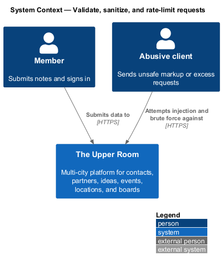
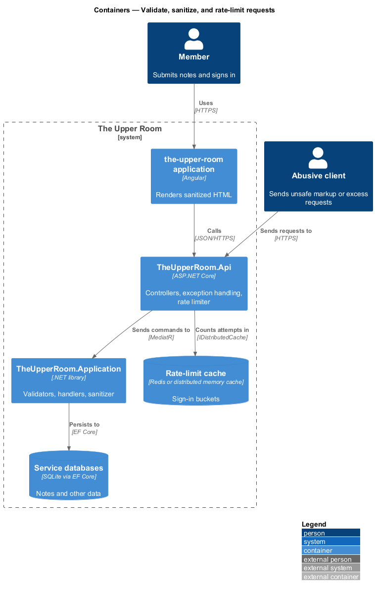
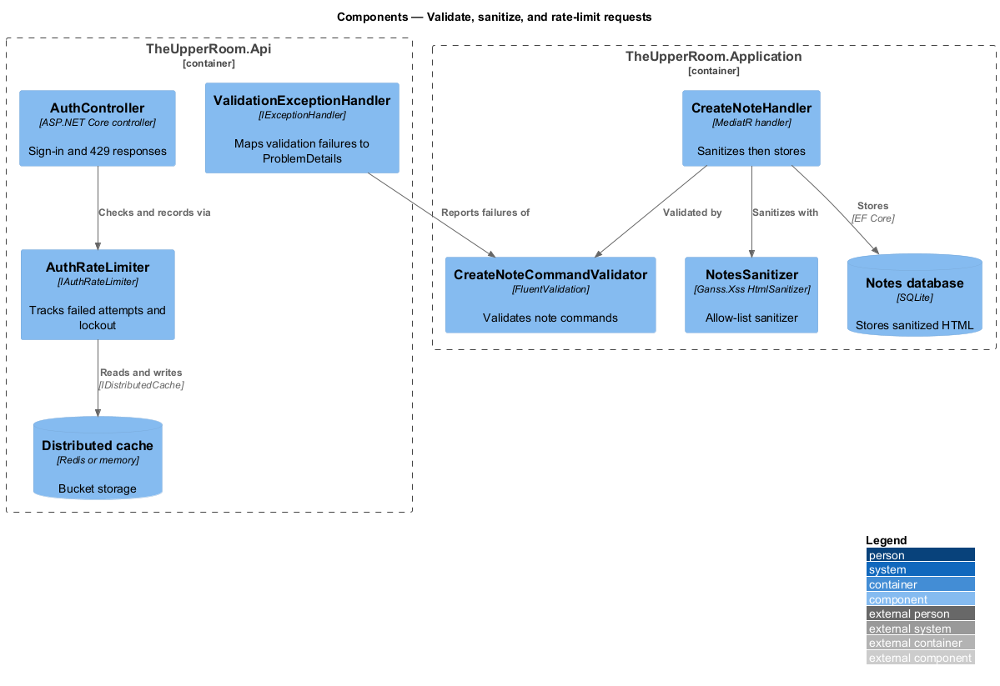
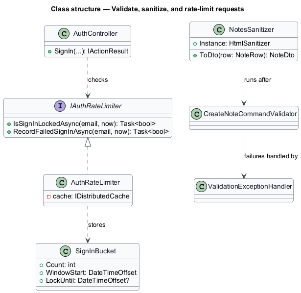
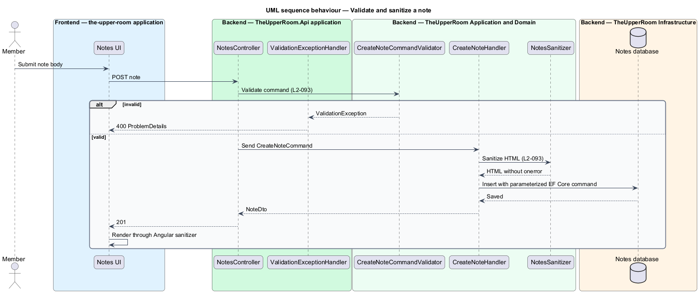
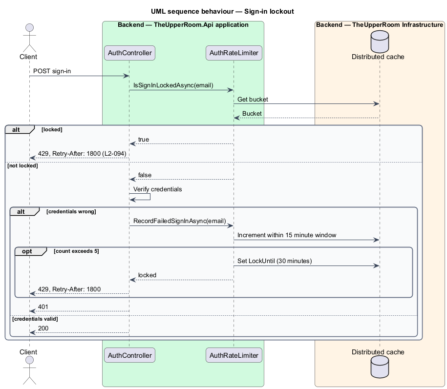

# Validate, sanitize, and rate-limit requests

## Overview

Requests to the API can carry malformed data, active HTML, or abusive volumes. This feature defines server-side validation, HTML sanitization, and rate limiting.

**sanitization** — removal of unsafe markup, such as event-handler attributes, from user-supplied HTML before storage

**lockout** — period during which further sign-in attempts for an email are refused

The feature is a cross-cutting application and API slice. Validators run in the application layer, the sanitizer runs before notes are stored, and the rate limiter runs in the authentication controller.

## Description

### Existing implementation

The following source elements provide the current implementation points. Their presence does not establish complete requirement coverage.

| Source | Concrete elements | Observed surface |
|---|---|---|
| [backend/src/TheUpperRoom.Application/Contacts/CreateContactCommandValidator.cs](../../../../backend/src/TheUpperRoom.Application/Contacts/CreateContactCommandValidator.cs) | `CreateContactCommandValidator` and about 30 sibling `*CommandValidator` classes | FluentValidation validators for auth, contacts, events, kanban, notes, and notifications commands |
| [backend/src/TheUpperRoom.Api/ExceptionHandling](../../../../backend/src/TheUpperRoom.Api/ExceptionHandling) | `ValidationExceptionHandler` | Registered with `AddExceptionHandler`; maps validation failures to ProblemDetails |
| [backend/src/TheUpperRoom.Application/Notes/NotesSanitizer.cs](../../../../backend/src/TheUpperRoom.Application/Notes/NotesSanitizer.cs) | `NotesSanitizer` | Ganss.Xss `HtmlSanitizer` with an allow-list of 17 tags; `ToDto` exposes `BodyHtmlSanitized` |
| [backend/src/TheUpperRoom.Api/Sanitization/SanitizeController.cs](../../../../backend/src/TheUpperRoom.Api/Sanitization/SanitizeController.cs) | `SanitizeController`, `SanitizeRequest` | Endpoint exposing sanitization |
| [backend/src/TheUpperRoom.Api/Auth/AuthRateLimiter.cs](../../../../backend/src/TheUpperRoom.Api/Auth/AuthRateLimiter.cs) | `AuthRateLimiter`, `IAuthRateLimiter` | `IDistributedCache`-backed sign-in bucket with a 15 minute window and lock-until timestamp |
| [backend/src/TheUpperRoom.Api/Auth/AuthController.cs](../../../../backend/src/TheUpperRoom.Api/Auth/AuthController.cs) | `AuthController` | Returns 429 `rate_limit_exceeded` with `Retry-After: 1800` |
| [backend/src/TheUpperRoom.Api/Program.cs](../../../../backend/src/TheUpperRoom.Api/Program.cs) | Cache selection | Redis in Production (required), distributed memory cache otherwise |

### Target behavior and interfaces

Every command and query shall be validated with FluentValidation before the handler runs. Note bodies shall be sanitized with `Ganss.Xss` before storage and shall be rendered through the Angular sanitizer.

Persistence shall use EF Core parameterized queries only.

Sign-in shall allow 5 failed attempts per email in 15 minutes and then lock out for 30 minutes. Forgot-password shall allow 3 requests per email per hour. Other endpoints shall allow 600 requests per minute per user and 60 per minute per IP when unauthenticated. Limited responses shall carry 429 and `Retry-After`.

### Gaps and compatibility

- The sign-in limiter exists. A forgot-password limit, a 600 RPM per-user limit, and a 60 RPM per-IP limit were not located (`<TO SUPPLY>`).
- The allow-list sanitizer applies to notes. Other user-supplied HTML fields `<TO SUPPLY>`.
- Whether every controller path relies on validators rather than ad hoc checks requires an audit `<TO SUPPLY>`.

Production implementation shall follow [AGENTS.md](../../../../AGENTS.md), including incremental acceptance testing. Existing behavior shall remain compatible until an explicit change is approved.

## Requirements

The table preserves the requirement statement and all parent identifiers. The expandable source excerpts retain the complete normative text and acceptance criteria verbatim.

| L2 ID | Refines (L1) | Requirement |
|---|---|---|
| [L2-093](../../../specs/L2.md#l2-093-input-validation-and-output-encoding) | `L1-020`, `L1-028` | All inputs must be validated server-side with FluentValidation. All HTML rendered from user input must be sanitized with `Ganss.Xss` (HtmlSanitizer) on the server before storage and Angular's built-in sanitizer on render. SQL access is exclusively through EF Core parameterized queries -- no raw concatenation. |
| [L2-094](../../../specs/L2.md#l2-094-rate-limiting) | `L1-020` | Sign-in attempts: 5 per email per 15 minutes; otherwise lockout for 30 minutes. Forgot-password: 3 per email per hour. Generic API: 600 RPM per user, 60 RPM per IP for unauthenticated endpoints. Returns HTTP 429 with `Retry-After` header. |

L2-093: Input Validation and Output Encoding — specification excerpt

All inputs must be validated server-side with FluentValidation. All HTML rendered from user input must be sanitized with `Ganss.Xss` (HtmlSanitizer) on the server before storage and Angular's built-in sanitizer on render. SQL access is exclusively through EF Core parameterized queries -- no raw concatenation.

**Acceptance Criteria:**
1. Given a note body ``, when stored, then the persisted HTML has no `onerror`.

L2-094: Rate Limiting — specification excerpt

Sign-in attempts: 5 per email per 15 minutes; otherwise lockout for 30 minutes. Forgot-password: 3 per email per hour. Generic API: 600 RPM per user, 60 RPM per IP for unauthenticated endpoints. Returns HTTP 429 with `Retry-After` header.

**Acceptance Criteria:**
1. Given the 6th failed sign-in within 15 minutes, when attempted, then the response is 429 with `Retry-After: 1800`.

## Diagrams

### System context

The context identifies the people and external systems around this capability.

### Container view

The container view separates browser, API, build, and data responsibilities for this capability.

### Component view

The component view shows the concrete implementation points and the target responsibilities that collaborate in this slice.

### Type structure

The structure view lists the types in this slice with members where known. Dashed dependencies denote target collaboration rather than verified current dependency direction.

### Validate and sanitize a note

The sequence shows a note body with an event-handler attribute passing validation and being stored without the attribute, and an invalid body being rejected.

### Sign-in rate limit and lockout

The sequence shows failed sign-ins accumulating in a bucket and the sixth attempt receiving 429 with a Retry-After header.

