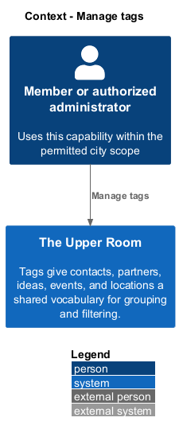
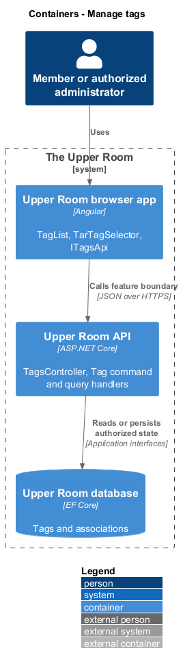
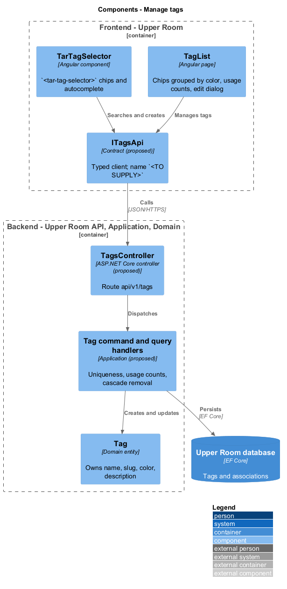
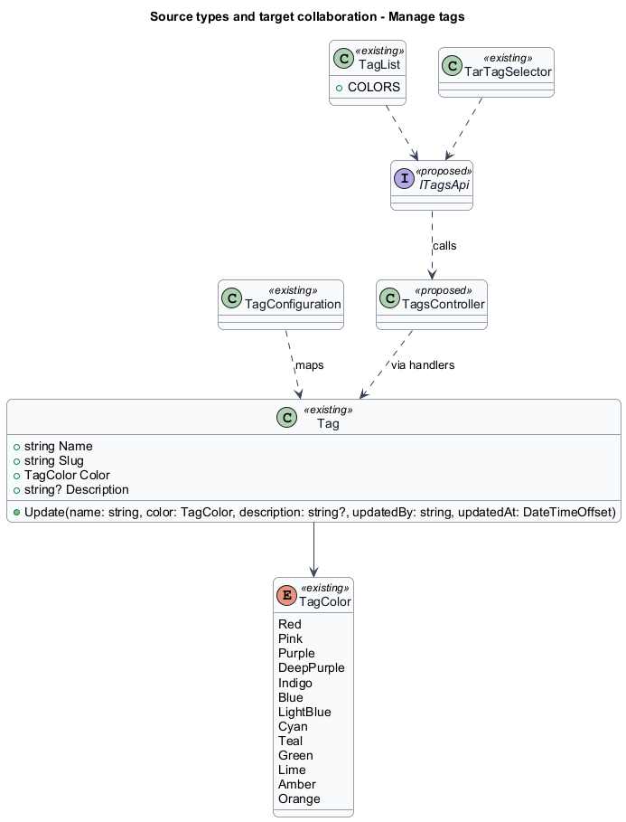
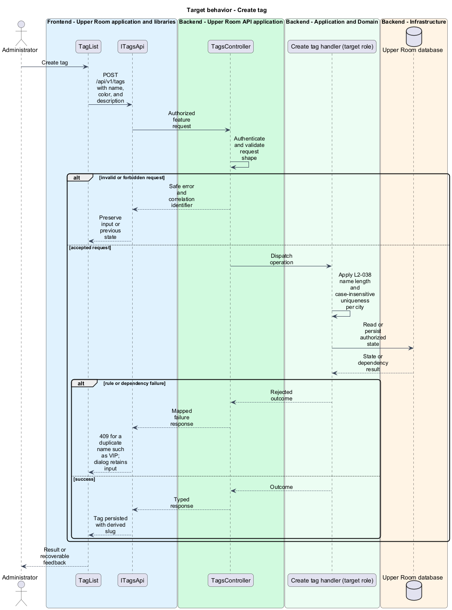
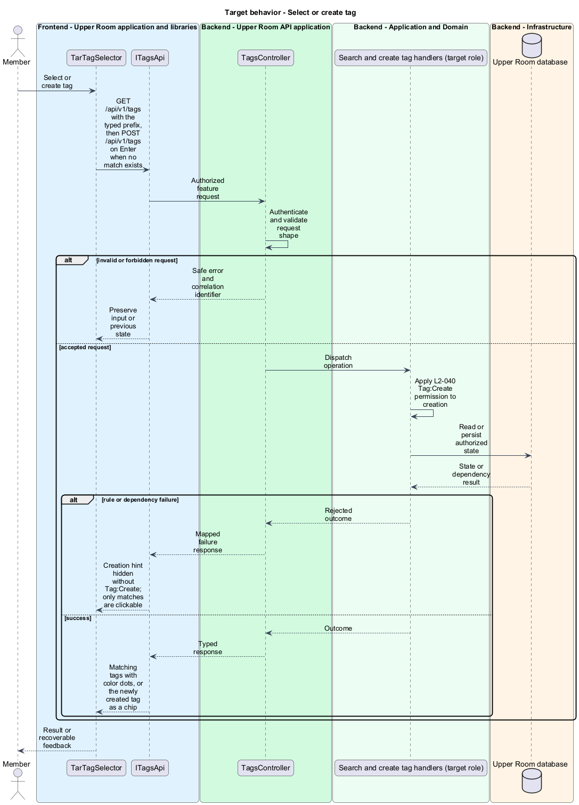
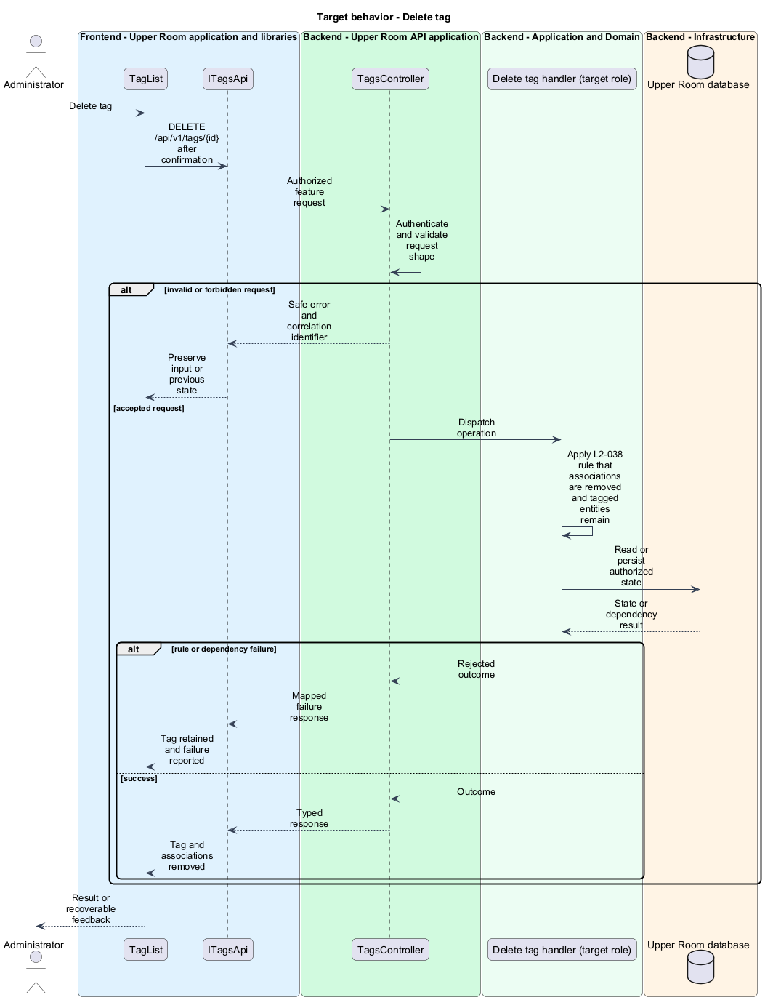

# Manage tags

## Overview

Tags give contacts, partners, ideas, events, and locations a shared vocabulary for grouping and filtering.

**tag** — city-scoped label with a name, a color from a fixed palette, and an optional description.

**tag selector** — reusable control that shows the selected tags as chips and offers autocomplete and creation.

The feature covers the tag data model, the administrator management page, and the selector used on entity forms.

## Description

### Existing implementation

The following source elements provide the current implementation points. Their presence does not establish complete requirement coverage.

| Source | Concrete elements | Observed surface |
|---|---|---|
| [backend/src/TheUpperRoom.Domain/Tags/Tag.cs](../../../../backend/src/TheUpperRoom.Domain/Tags/Tag.cs) | `Tag`, `TagColor` | `Name` guarded to 50 characters; `Slug` derived by `SlugGenerator.From`; `Update` recomputes the slug |
| [backend/src/TheUpperRoom.Infrastructure/Data/Configurations/TagConfiguration.cs](../../../../backend/src/TheUpperRoom.Infrastructure/Data/Configurations/TagConfiguration.cs) | `TagConfiguration` | EF Core mapping of `Tag` |
| [frontend/projects/the-upper-room/src/app/tags/tag-list/tag-list.ts](../../../../frontend/projects/the-upper-room/src/app/tags/tag-list/tag-list.ts) | `COLORS`, `TagList` | Admin page; calls `DELETE /api/v1/tags/{id}` through `HttpClient` |
| [frontend/projects/domain/src/lib/tags/tag.model.ts](../../../../frontend/projects/domain/src/lib/tags/tag.model.ts) | `Tag` | Frontend tag model |
| [frontend/projects/domain/src/lib/tags/tag-selector/tar-tag-selector.ts](../../../../frontend/projects/domain/src/lib/tags/tag-selector/tar-tag-selector.ts) | `TarTagSelector` | Injects `HttpClient` and `PERMISSIONS_SERVICE` for `Tag:Create` checks |
| [backend/src/TheUpperRoom.Api/Partners/TagRef.cs](../../../../backend/src/TheUpperRoom.Api/Partners/TagRef.cs) | `TagRef` | Tag reference embedded in partner payloads |

### Target behavior and interfaces

`TagList` and `TarTagSelector` shall call a typed tags API contract (`ITagsApi` with an injection token, name `<TO SUPPLY>`). A tags controller and handlers shall enforce case-insensitive name uniqueness per city, return `409` on a duplicate, and remove all associations when a tag is deleted while retaining the tagged entities.

- **Create tag:** `POST /api/v1/tags` validates name, color, and description.
- **Rename tag:** `PUT /api/v1/tags/{id}` updates name, color, and description; tagged entities show the new name on next render.
- **Select tags:** `GET /api/v1/tags` supplies autocomplete matches; creation on Enter requires `Tag:Create`.
- **Delete tag:** `DELETE /api/v1/tags/{id}` removes associations only.

Diagrams show target collaborations. Existing source types retain their names. Participants marked as proposed or target roles describe interfaces to introduce, not existing classes.

### Gaps and compatibility

No tags controller, handler, or `DbContext` set exists in `backend/src`; only the `Tag` domain entity and its EF configuration are present. The `/api/v1/tags` routes called by the frontend are therefore a target change. Usage counts per entity type and the Contact, Partner, Idea, Event, Location association storage are `<TO SUPPLY>`. The `TagColor` enum in source declares 13 values, while the requirement text states "12 predefined"; the discrepancy is unresolved (`<TO SUPPLY>`).

Production implementation shall follow [AGENTS.md](../../../../AGENTS.md), including incremental acceptance testing. API integrations shall preserve documented behavior until an explicit compatibility change is approved.

## Requirements

The table preserves each requirement statement and all parent identifiers. The expandable source excerpts retain the acceptance criteria verbatim.

| L2 ID | Refines (L1) | Requirement |
|---|---|---|
| [L2-038](../../../specs/L2.md#l2-038-tag-data-model) | `L1-006` | A Tag must have: `id`, `cityId`, `name` (1-50, unique within city, case-insensitive), `slug` (auto-derived), `color` (one of 12 predefined M3 chip colors: red, pink, purple, deepPurple, indigo, blue, lightBlue, cyan, teal, green, lime, amber, orange), `description` (optional, max 200), `createdAt`, `createdBy`. Tags can be applied to Contact, Partner, Idea, Event, Location. |
| [L2-039](../../../specs/L2.md#l2-039-tag-management-page-admin) | `L1-006`, `L1-003` | Route `/admin/tags` shows a list of tag chips grouped by color, with usage counts (e.g. "VIP · 12 contacts, 3 partners"). Click a chip to edit (name, color, description); a "New tag" filled button creates one. |
| [L2-040](../../../specs/L2.md#l2-040-tag-selector-component) | `L1-006` | A reusable `<tar-tag-selector>` (in `components` lib) renders selected tags as `mat-chip`s with a leading dot of the tag color, removable, plus an autocomplete input "Add tag..." with creation on Enter when no match exists (if user has `Tag:Create`). |

L2-038: Tag Data Model — specification excerpt

A Tag must have: `id`, `cityId`, `name` (1-50, unique within city, case-insensitive), `slug` (auto-derived), `color` (one of 12 predefined M3 chip colors: red, pink, purple, deepPurple, indigo, blue, lightBlue, cyan, teal, green, lime, amber, orange), `description` (optional, max 200), `createdAt`, `createdBy`. Tags can be applied to Contact, Partner, Idea, Event, Location.

**Acceptance Criteria:**
1. Given a duplicate tag name "VIP" (case-insensitive) in the same city, when created, then the API returns 409.
2. Given a tag is deleted, when persisted, then all m..n associations are removed but the tagged entities remain.

L2-039: Tag Management Page (Admin) — specification excerpt

Route `/admin/tags` shows a list of tag chips grouped by color, with usage counts (e.g. "VIP · 12 contacts, 3 partners"). Click a chip to edit (name, color, description); a "New tag" filled button creates one.

**Acceptance Criteria:**
1. Given a tag is renamed, when saved, then all entities tagged with it reflect the new name immediately on next render and a snackbar "Tag updated" appears.

L2-040: Tag Selector Component — specification excerpt

A reusable `<tar-tag-selector>` (in `components` lib) renders selected tags as `mat-chip`s with a leading dot of the tag color, removable, plus an autocomplete input "Add tag..." with creation on Enter when no match exists (if user has `Tag:Create`).

**Acceptance Criteria:**
1. Given the user types "vi", when matches load, then "VIP" appears in the autocomplete with its color dot.
2. Given the user has no `Tag:Create` permission, when typing a non-existent tag, then "Press Enter to create" hint is hidden and only matches are clickable.

## Diagrams

### System context

The context identifies the people and application boundary used by this capability.

### Container view

The container view separates browser execution from backend state responsibility.

### Target component view

The component view shows target collaborations between the concrete implementation points and proposed responsibilities.

### Type structure

The structure view lists source types with declared members where available. Types marked proposed describe interfaces to introduce.

### Create tag

The flow performs the following operation: POST /api/v1/tags with name, color, and description. Its successful outcome is: Tag persisted with derived slug. The alternate branch yields: 409 for a duplicate name such as VIP; dialog retains input.

### Rename tag

The flow performs the following operation: PUT /api/v1/tags/{id} with name, color, and description. Its successful outcome is: Tag updated; snackbar Tag updated; tagged entities show the new name. The alternate branch yields: Safe error; previous name retained.

### Select or create tag

The flow performs the following operation: GET /api/v1/tags with the typed prefix, then POST /api/v1/tags on Enter when no match exists. Its successful outcome is: Matching tags with color dots, or the newly created tag as a chip. The alternate branch yields: Creation hint hidden without Tag:Create; only matches are clickable.

### Delete tag

The flow performs the following operation: DELETE /api/v1/tags/{id} after confirmation. Its successful outcome is: Tag and associations removed. The alternate branch yields: Tag retained and failure reported.

