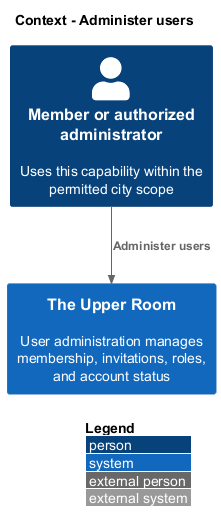
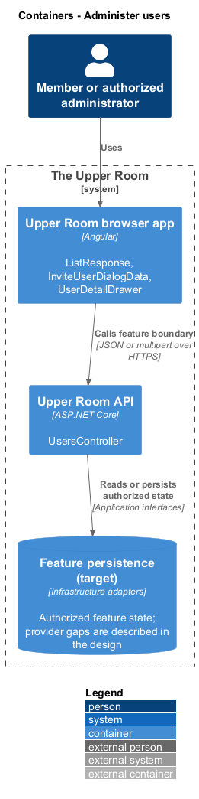
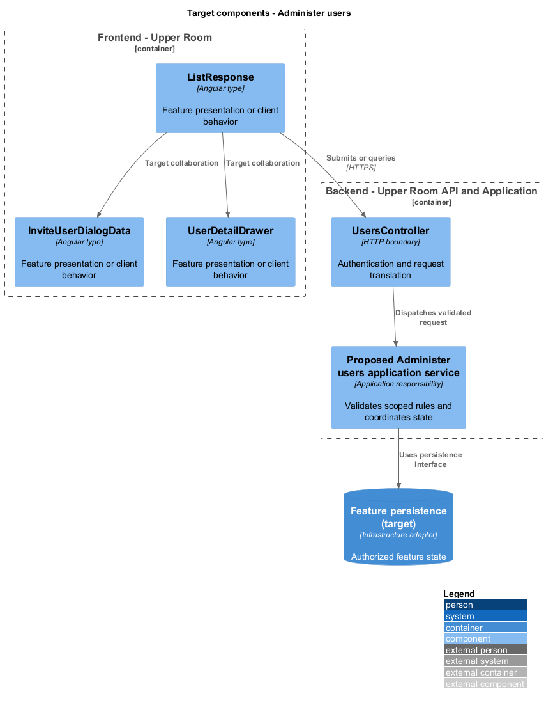
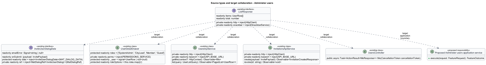
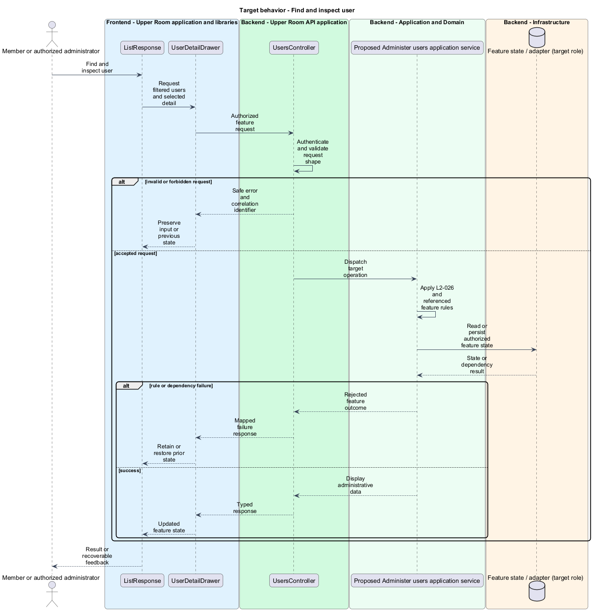
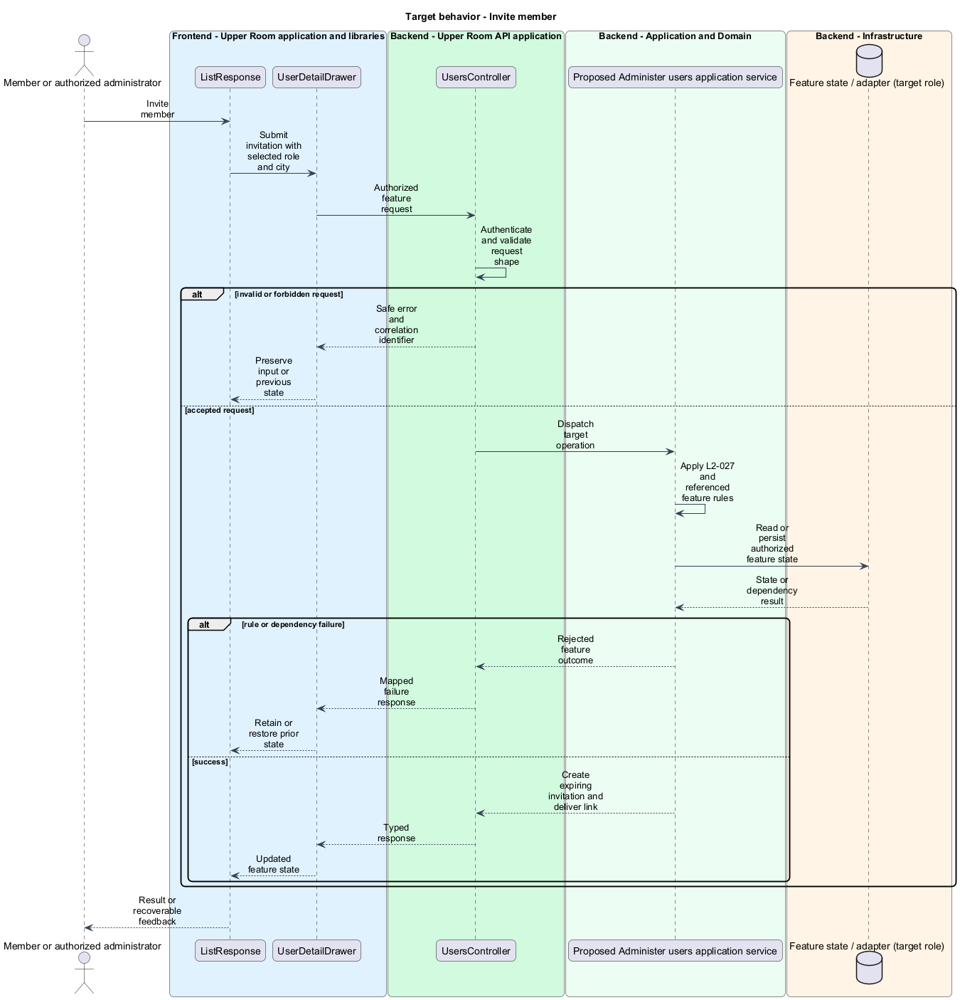
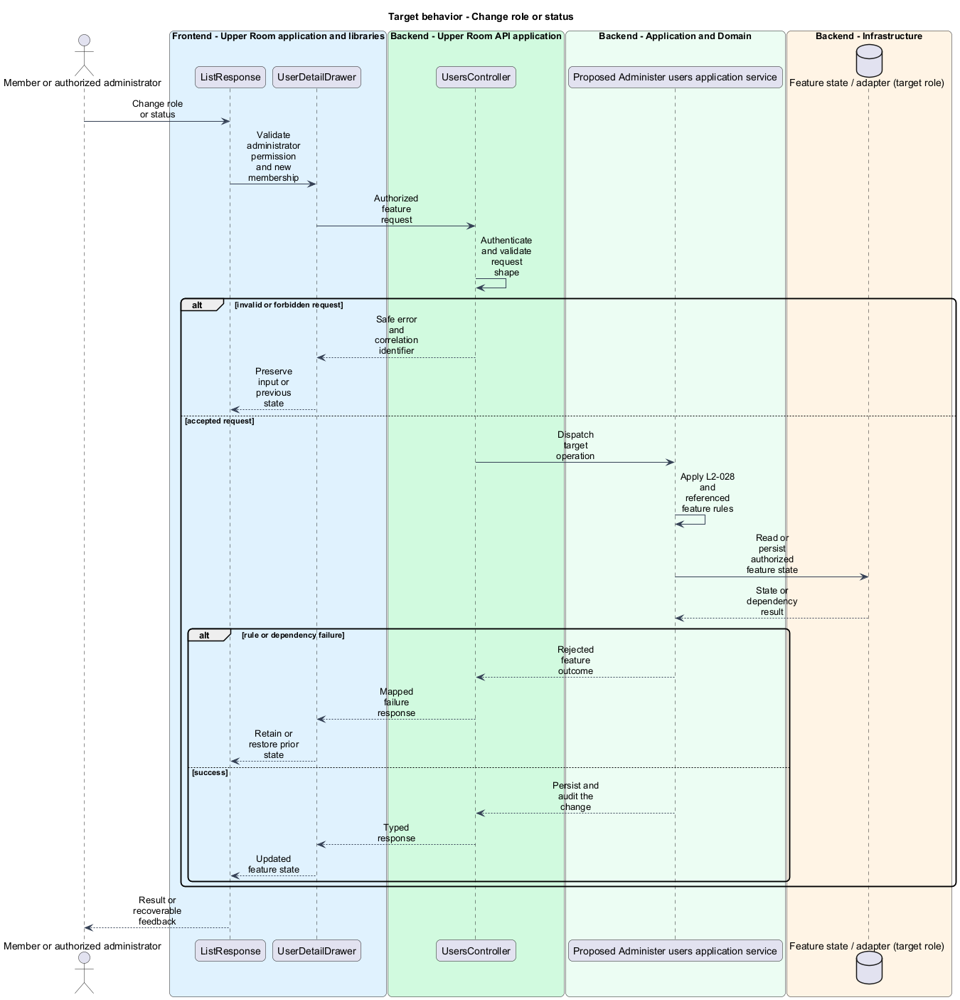

# Administer users

## Overview

The Upper Room manages contacts, partners, ideas, events, locations, and boards in city-scoped workspaces.

User administration manages membership, invitations, roles, and account status. An invitation grants a pending recipient a controlled registration path.

## Description

### Existing implementation

The following source elements provide the current implementation points. Their presence does not establish complete requirement coverage.

| Source | Concrete elements | Observed surface |
|---|---|---|
| [frontend/projects/the-upper-room/src/app/users/user-list/user-list.ts](../../../../frontend/projects/the-upper-room/src/app/users/user-list/user-list.ts) | `ListResponse`, `UserList` | readonly items: UserRow[]; readonly total: number; private readonly http = inject(HttpClient) |
| [frontend/projects/domain/src/lib/users/invite-user-dialog/invite-user-dialog.ts](../../../../frontend/projects/domain/src/lib/users/invite-user-dialog/invite-user-dialog.ts) | `InviteUserDialogData`, `InviteUserDialog` | readonly emailError: Signal<string \| null>; readonly onSubmit: (payload: InvitePayload); protected readonly data = inject<InviteUserDialogData>(MAT_DIALOG_DATA) |
| [frontend/projects/domain/src/lib/users/user-detail-drawer/user-detail-drawer.ts](../../../../frontend/projects/domain/src/lib/users/user-detail-drawer/user-detail-drawer.ts) | `UserDetailDrawer` | private readonly perms = inject(PERMISSIONS_SERVICE); protected readonly _user = signal<UserRow \| null>(null); protected readonly roles = ['SystemAdmin', 'CityLead', 'Member', 'Guest'] |
| [frontend/projects/api/src/lib/users/users-api.service.ts](../../../../frontend/projects/api/src/lib/users/users-api.service.ts) | `UsersApiService` | private readonly http = inject(HttpClient); private readonly baseUrl = inject(API_BASE_URL); getMe(context?: HttpContext): Observable<Me> |
| [frontend/projects/api/src/lib/invitations/invitations-api.service.ts](../../../../frontend/projects/api/src/lib/invitations/invitations-api.service.ts) | `InvitationsApiService` | private readonly http = inject(HttpClient); private readonly baseUrl = inject(API_BASE_URL); create(payload: InvitePayload): Observable<InvitationCreatedResponse> |
| [backend/src/TheUpperRoom.Api/Rbac/UsersController.cs](../../../../backend/src/TheUpperRoom.Api/Rbac/UsersController.cs) | `UsersController` | Route api/v1/users; HttpGet me |

### Target behavior and interfaces

UserList shall obtain paginated results through IUsersApi. InviteUserDialog shall validate recipient, role, and city and use IInvitationsApi. UserDetailDrawer shall load administrative detail and submit permitted changes. Backend operations shall authorize administration, scope the city, and audit role or status changes.

- **Find and inspect user:** Request filtered users and selected detail. Display administrative data.
- **Invite member:** Submit invitation with selected role and city. Create expiring invitation and deliver link.
- **Change role or status:** Validate administrator permission and new membership. Persist and audit the change.

Diagrams show target collaborations. Existing source types retain their names. Participants marked as target roles or proposed responsibilities describe interfaces to introduce, not existing classes.

### Gaps and compatibility

The UI and typed clients exist. UsersController in the API currently defines the me action; administrative endpoints represented by frontend clients shall be reconciled with actual server routes. Invitation delivery and complete sign-in history persistence are <TO SUPPLY>.

Production implementation shall follow [AGENTS.md](../../../../AGENTS.md), including incremental acceptance testing. API integrations shall preserve documented behavior until an explicit compatibility change is approved.

## Requirements

The table preserves the opening requirement statement and all parent identifiers. The expandable source excerpts retain the complete normative text and acceptance criteria verbatim. Source wording is quoted rather than normalized to the design prose.

| L2 ID | Refines (L1) | Requirement |
|---|---|---|
| [L2-026](../../../specs/L2.md#l2-026-user-list-page) | `L1-002`, `L1-003` | Route `/admin/users` displays a `mat-table` with columns: Avatar (40px), Name (`body-large`), Email (`body-medium`), Role (chip), City, Status (chip: Active green, Disabled gray, Pending yellow), Last Sign-In, Actions. Toolbar above table: search (debounced 300ms, min 2 chars), filter chips (Role, City, Status), "Invite user" filled button (icon `add`). Pagination 25/50/100. |
| [L2-027](../../../specs/L2.md#l2-027-invite-user-dialog) | `L1-002` | Clicking "Invite user" opens a `mat-dialog` (width `min(560px, 100vw - $space-8)`, padding `$space-6`) with title "Invite user", fields: Email (required), First Name (required), Last Name (required), Role (required, single-select), City (required, autocomplete), Personal message (optional, multi-line, max 500 chars). Footer has "Cancel" (text) and "Send invitation" (filled). |
| [L2-028](../../../specs/L2.md#l2-028-user-detail-drawer) | `L1-002` | Clicking a user row opens a right-side `mat-drawer` of width `480px` (or full screen on XS) showing the user's avatar (96px), name (`headline-small`), email, status, role, city, sign-in history (last 10), audit summary, and actions: "Reset password", "Change role", "Disable", "Delete". |

L2-026: User List Page — specification excerpt

Route `/admin/users` displays a `mat-table` with columns: Avatar (40px), Name (`body-large`), Email (`body-medium`), Role (chip), City, Status (chip: Active green, Disabled gray, Pending yellow), Last Sign-In, Actions. Toolbar above table: search (debounced 300ms, min 2 chars), filter chips (Role, City, Status), "Invite user" filled button (icon `add`). Pagination 25/50/100.

**Acceptance Criteria:**
1. Given the search input has the value "alice", when 300ms have passed, then a `GET /api/users?search=alice` is sent exactly once.
2. Given a list of 0 users, when rendered, then the empty state shows icon `group_off` (size `xl`), heading "No users found", body "Try adjusting your filters or invite a new user." and an "Invite user" button.

L2-027: Invite User Dialog — specification excerpt

Clicking "Invite user" opens a `mat-dialog` (width `min(560px, 100vw - $space-8)`, padding `$space-6`) with title "Invite user", fields: Email (required), First Name (required), Last Name (required), Role (required, single-select), City (required, autocomplete), Personal message (optional, multi-line, max 500 chars). Footer has "Cancel" (text) and "Send invitation" (filled).

**Acceptance Criteria:**
1. Given a valid invitation form, when "Send invitation" is clicked, then a snackbar "Invitation sent to {email}" appears for `5000ms` with action "Undo" that revokes the invite within 10 seconds.
2. Given submission fails with HTTP 409 (already invited), when handled, then the dialog stays open and the email field shows the error "This email already has a pending invitation."

L2-028: User Detail Drawer — specification excerpt

Clicking a user row opens a right-side `mat-drawer` of width `480px` (or full screen on XS) showing the user's avatar (96px), name (`headline-small`), email, status, role, city, sign-in history (last 10), audit summary, and actions: "Reset password", "Change role", "Disable", "Delete".

**Acceptance Criteria:**
1. Given an admin clicks "Disable", when confirmed, then the user's status becomes "Disabled", they are signed out of all sessions, and a snackbar "User disabled" is shown.
2. Given the admin views their own row, when the drawer opens, then "Disable" and "Delete" are not rendered.

## Diagrams

### System context

The context identifies the people and application boundary used by this capability.

### Container view

The container view separates browser execution from any backend state responsibility. Provider choices remain subject to the stated gaps.

### Target component view

The component view shows target collaborations between the concrete implementation points and proposed application responsibilities.

### Type structure

The structure view lists source types with declared members where available. Dashed dependencies denote proposed collaboration rather than verified current dependency direction.

### Find and inspect user

The target flow performs the following operation: Request filtered users and selected detail. Its successful outcome is: Display administrative data. Alternate branches retain prior state or return recoverable failure.

### Invite member

The target flow performs the following operation: Submit invitation with selected role and city. Its successful outcome is: Create expiring invitation and deliver link. Alternate branches retain prior state or return recoverable failure.

### Change role or status

The target flow performs the following operation: Validate administrator permission and new membership. Its successful outcome is: Persist and audit the change. Alternate branches retain prior state or return recoverable failure.

